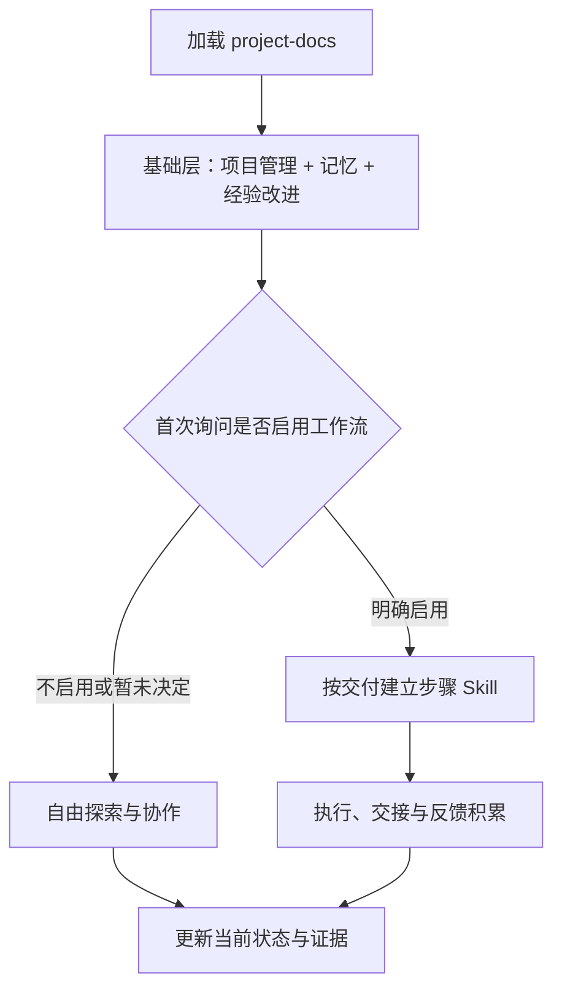
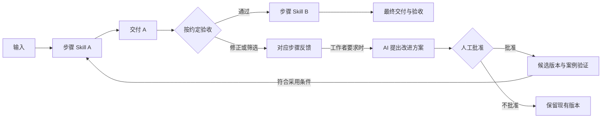

# projectskill

### 让项目接得上，让经验用得上。

**项目记忆 · 证据与边界 · 可选工作流**

[下载 Skill](project-docs-v3.1.skill) · [核心规则](SKILL.md) · [工作流说明](references/workflow.md)

---

把对话中的偏好、决定、否决理由和未完成工作，压缩成项目可以长期使用的记忆。换会话、换 Agent，也能找到继续工作的依据。

## 两层能力，自由选择

| 始终启用 · 基础层 | 按需启用 · 工作流层 |
|---|---|
| 项目状态、范围和交付证据 | 按可验收交付拆分步骤 |
| 对话记忆与跨会话接手 | 每步建立可复用 Skill |
| 经验验证、过时规则撤回 | 人工筛选与修正归入对应步骤 |
| 授权范围内自主选择方法 | 按需提案，批准并验证后更新 |

> 创意性工作不必有固定流程。首次加载会提示可选能力；选择按项目保存，不反复询问。随时可暂停，基础能力不受影响。

## 从交付中改进

固定交付要求，保留方法自由。每次修改不会直接变成永久规则，AI 自评也不会冒充人工验收。逐步减少监督是需要验证的目标，不是安装后的保证。

## 开始使用

1. 下载 [v3.1 安装包](project-docs-v3.1.skill)，导入支持 `.skill` 的工具；或将 `SKILL.md` **连同 `references/`** 放入 Agent 的 `project-docs/` Skill 目录。
2. 在项目的 `AGENTS.md` 或 `CLAUDE.md` 中注明：

   > 本项目按 project-docs 管理，状态文件是 PROJECT.md。

3. 开始协作，选择是否启用工作流。入口是否自动加载取决于工具，不支持时主动提供 Skill 与状态文件。

## 少量文件，明确分工

| 文件 | 保存什么 |
|---|---|
| `PROJECT.md` 或已有 `HANDOFF.md` | 唯一当前状态、偏好、待办与模式选择 |
| `LEARNINGS.md` | 有效经验、决定与否决理由 |
| `RUN_LOG.md` | 按需查阅的历史证据 |
| 启用后：`WORKFLOW.md` 与步骤目录 | 交付关系、步骤 Skill、反馈和验证依据 |

小任务可以只用状态文件；可选层仅在启用后创建所需内容。

<strong>v3.1 更新与适用边界</strong>

新增可选工作流层、按步骤积累人工反馈、按需提出改进方案及批准后的版本验证。基础项目管理与经验改进继续保留。

这是纯文本协作协议，由所在 Agent 执行，不附带后台服务或无人值守运行系统。格式与包内容校验不等于教学、创作或业务效果验证；新工作流能力尚未完成真实项目行为评测。

